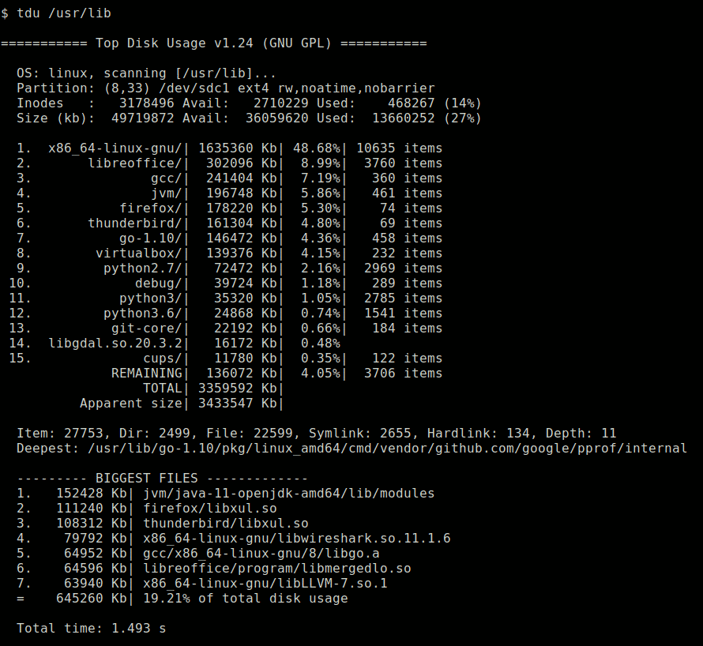

# tdu - Top Disk Usage
This command-line tool estimates the disk space occupied by all files in a
given path. It displays a sorted list of the biggest items. The estimation
method is similar to the `du -skx` command from GNU Coreutils package.

##Program usage
```
Usage: tdu [options] [directory]

  -b n       Number of big files shown (default 7)

  -l n       Number of depth1 items shown (default 15)

  --nomax    Do not show deepest and longest paths

  -o file    Export result to Ncdu JSON format
             (https://dev.yorhel.nl/ncdu/jsonfmt)

  --version  Program info and usage
  --license  Show the GNU General Public License V2
  --help     Program help
```
##Quick start guide for end users
- If you just want to use the program on Linux x86-64, then you can download a ready-to-run binary at https://bitbucket.org/josephpaul0/tdu/downloads/

##Quick start guide for advanced users / developers
- You need a Go compiler and a Linux OS
- Clone the git repository or download the source archive.
- Run 'make' to build the binary

##Other Operating Systems
- If you use Windows, FreeBSD, or macOS, then you can submit patches for supporting those operating systems.

##Project information:
- Author:   Joseph Paul
- Homepage: https://bitbucket.org/josephpaul0/tdu
- License:  GNU General Public Licence version 2.

##Screenshot

